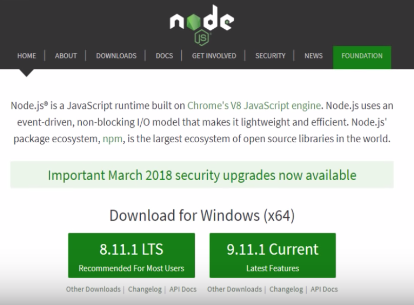
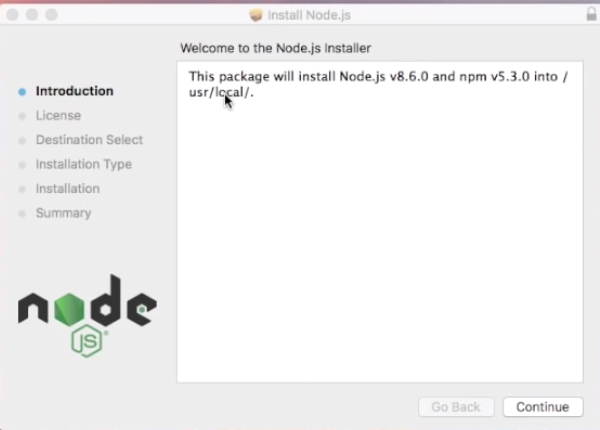
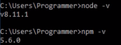
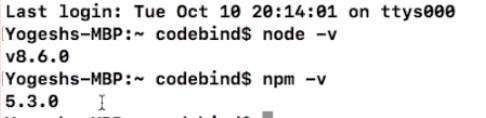
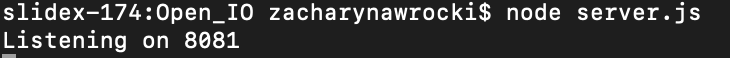
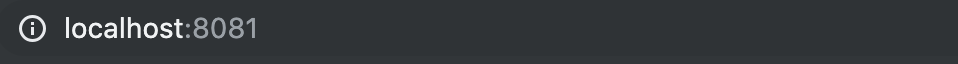

# Open IO
Open IO is an online multiplayer IO snake game that uses javascript, react, Node.js, and socket.io

# Resources
Blog: https://rcos.io/projects/gibboa/open_io/blog  
Website: https://rcos.io/projects/gibboa/open_io/profile  
Repository: https://github.com/gibboa/Open_IO  

# Setting Up (Windows, MacOS)
1. Get Node.js
	1. Visit https://nodejs.org/en/
	2. Download Node 10.15.3 from the website.
	
	3. Once, downloaded, double click to install.
	4. The Node.js Setup Wizard will appear. Follow the instructions to Install.
	

2. Check if successfully installed  
	**On Windows 10**  
	If successfully installed, running "node -v" in Command Prompt will show your version of Node and running "npm -v" will show you your version of npm (your version should be different than the one in the image)  
	

	**On Mac OSX**  
	If successfully installed, running "node -v" in Terminal will show your version of Node and running "npm -v" will show
	your version of npm (your version should be different than the one in the image)  
	

# Setting Up (Linux)

1. Get Node.js
	**Debian, Ubuntu, Linux Mint**  
	$ sudo apt-get install nodejs npm

	**RHEL, CentOS**  
	$ sudo yum install epel-release

	**Fedora**  
	$ sudo dnf install nodejs npm

	**Arch Linux**  
	$ sudo pacman -S nodejs npm

2. Check if successfully installed.
	If successfully installed, running "node -v" in Terminal will show your version of Node and running "npm -v" will show you your version of npm (your version should be different than the one in the image)

# Running Open IO
1. Clone Open IO From GitHub

	Download from https://github.com/gibboa/open_io or clone with "git clone https://github.com/gibboa/Open_IO.git"

2. Running Open IO
	1. From your command line, go to the Open IO directory.
	2. Run the command "node server.js" to start running.
	3. You will receive the port where you can see it running. In the image below, the port is 8081
	
	4. In your web browser, visit "localhost:x" where x is the port number
	
	5. You should now see Open IO running.

